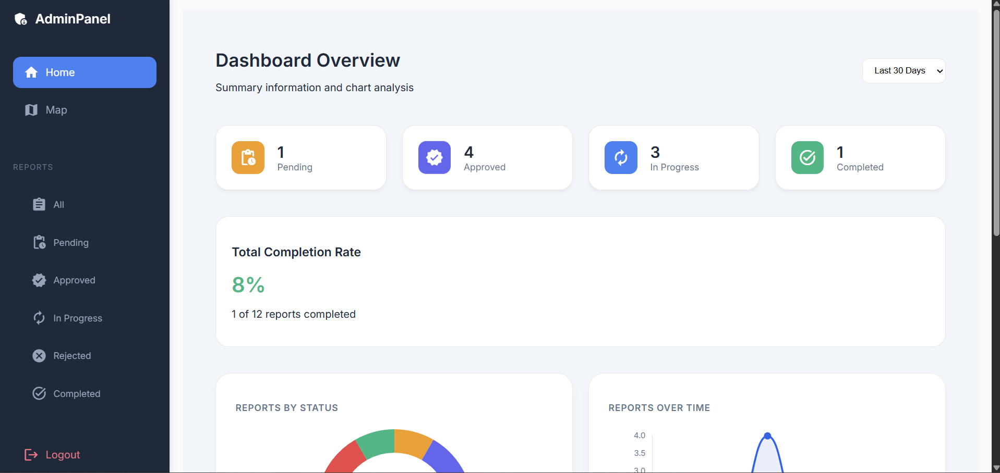
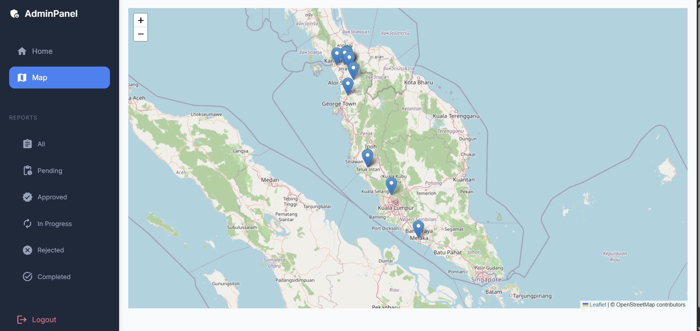
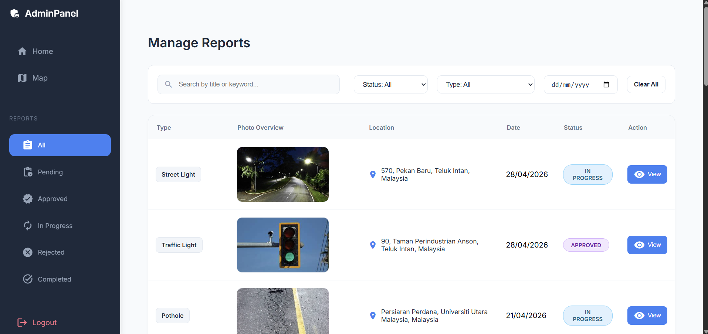
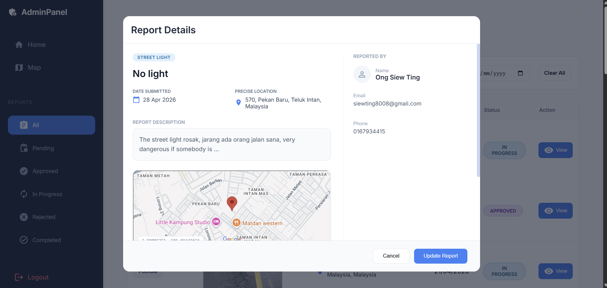

# FixMyRoad Admin
This project is to help the admin to easily manage road and infrastructure issues reported by users (citizens). It provide a clear data and summary dashboard to show how many reports resolved or in progress. For mobile application can refer to [FMR](https://github.com/St487/FixMyRoad)

## Screenshots






## Steps
1. Import ```backend/sql/fmrdb```
2. Run backend:
```bash
cd backend/admin/admin
```
```bash
mvn spring-boot:run
```
3. Run frontend
```bash
ng serve
```
4. Userid:```299430```  
Password:```123456```
